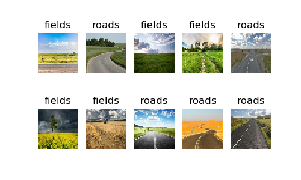
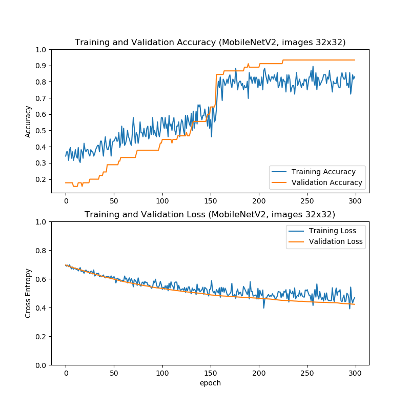

# FieldsRoadsClassifier

Train an image classification model using transfer learning with a limited dataset.

## Data

Our dataset consists of 163 images, distributed as follows:
- 45 images categorized as "fields"
- 108 images categorized as "roads"
- 10 images are unannotated, which can belong to either "fields" or "roads"

All images are at high resolution, but their sizes vary.

## Environment

The project is developed using Python 3.8.10, with the following libraries:
- TensorFlow 2.11.0
- Matplotlib 3.1.2

The training computations are performed on a RTX 3060Ti GPU, with 8GB of VRAM.

## Approach and Architecture

We employed transfer learning through convolutional neural networks (CNNs) for image classification.

Why transfer learning? Training a model from scratch using our limited dataset can lead to overfitting. However, leveraging transfer learning enables us to reuse general features learned from prior tasks and apply them to our problem, thereby enhancing robustness for future inferences. Moreover, this approach can accelerate the training process.

We tested various pre-trained models as feature extractors, freezing their weights during training. Our architecture consists of:
- a pre-trained feature extractor
- Global average pooling layer to flatten the output
- Dense layer with a single neuron for binary classification

Data augmentation techniques such as random horizontal flips, small rotations, and [Dropout](https://jmlr.org/papers/v15/srivastava14a.html) layers are used to improve model robustness.

### Dataset Segmentation

We construct four distinct datasets:
- Training dataset: Used for model training.
- Validation dataset: Monitors the model's learning progress.
- Test dataset: Contains annotated images for model testing.
- Qualitative test dataset: Includes unannotated images for visual performance analysis.

## Results and Experiments

### Experiment: Different Backbones

We experiment with various pre-trained models as feature extractors, fixing the input images to a size of (224, 224) and a batch size of 16. For each network, we implement early stopping with a patience of 5 during training.

| Model           | Test Accuracy |
| --------------- | ------------- |
| MobileNetV2     | 0.96875       |
| ConvNeXtBase    | 0.96875       |
| DenseNet121     | 1.0           |
| EfficientNetB0  | 1.0           |

The feature extractor has minimal impact on performance for this problem.

### Experiment: Input Image Sizes

We experiment with the influence of input image sizes on accuracy and inference time:

| Model (Input Image Size)  | Test Accuracy | Inference Time (per batch) |
| ------------------------- | ------------- | -------------------------- |
| MobileNetV2 (32x32)       | 0.84375       | 4                          |
| MobileNetV2 (64x64)       | 0.9375        | 5                          |
| MobileNetV2 (128x128)     | 0.96875       | 7                          |
| MobileNetV2 (224x224)     | 1.0           | 13                         |

We observe an improve in test accuracy as we improve the input image size, at the expense of inference time. This is a common dilemma in real-time applications: finding the good equilibrium between accuracy and inference time. In embedded systems, there's also a trade-off to consider regarding model size and computational efficiency.

Remarkably, even with image sizes of 32x32, promising results are obtained, as seen below:

# References

- Transfer learning and fine-tuning tutorial from [TensorFlow](https://www.tensorflow.org/tutorials/images/transfer_learning).